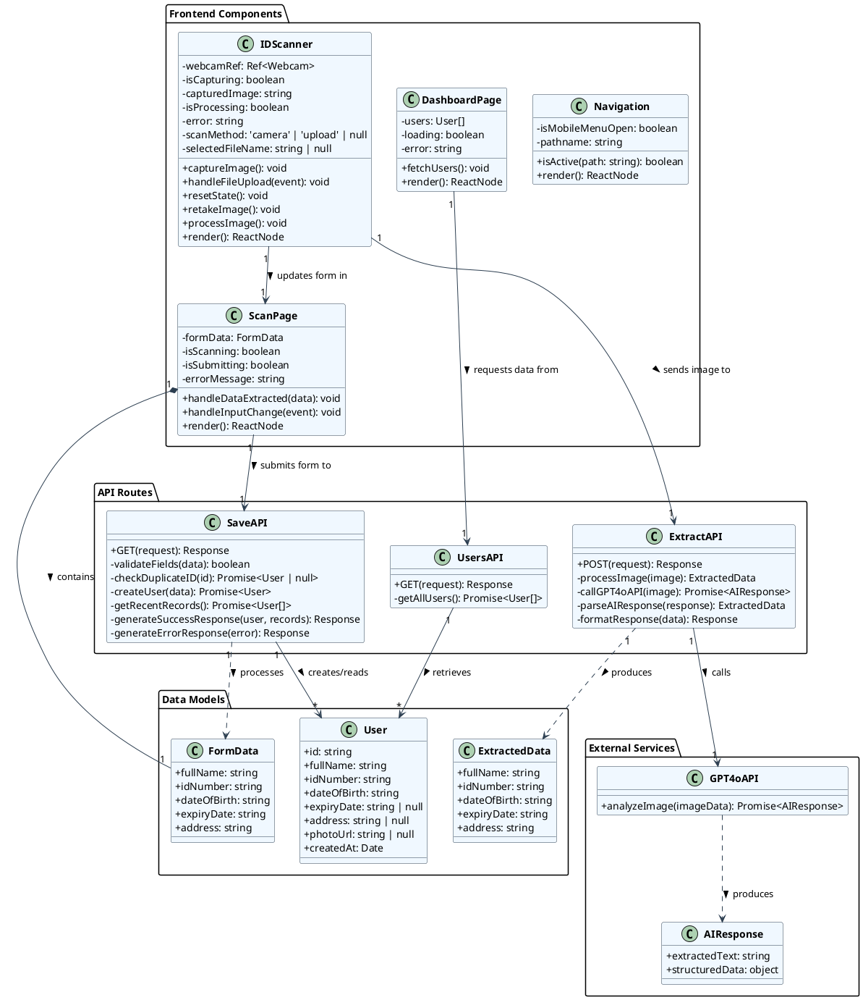

# ID Scanner Class Diagram

## Class Descriptions

### Frontend Components

1. **Navigation**
   - Manages the application navigation menu
   - Handles responsive behavior for mobile devices
   - Tracks current page state for highlighting active links

2. **IDScanner**
   - Manages camera access and image capture
   - Handles file uploads as alternative to camera
   - Processes captured images and extracts data
   - Communicates with the Extract API

3. **ScanPage**
   - Provides UI for ID document scanning and manual data entry
   - Manages form state and validation
   - Toggles between camera scanning and manual entry
   - Submits data to Save API

4. **DashboardPage**
   - Displays table of all saved records
   - Manages data fetching and loading states
   - Handles error conditions for database connection

### API Routes

1. **ExtractAPI**
   - Processes image data from ID Scanner
   - Communicates with GPT-4o API for text extraction
   - Parses AI response into structured data
   - Returns extracted information to the frontend

2. **SaveAPI**
   - Validates incoming form data
   - Checks for duplicate ID numbers
   - Persists data to database through Prisma
   - Generates appropriate HTML responses for success/error

3. **UsersAPI**
   - Retrieves user records from database
   - Sorts and formats data for dashboard display
   - Returns JSON data for frontend consumption

### External Services

1. **GPT4oAPI**
   - Analyzes image data and extracts text and structured data
   - Returns processed information to the Extract API

### Data Models

1. **User**
   - Represents the database model for stored ID information
   - Contains all fields required for ID records
   - Used for persistence and retrieval operations

2. **FormData**
   - Represents the structure of form input on the Scan page
   - Contains fields that match the User model
   - Used for temporary state in the UI before submission

3. **ExtractedData**
   - Represents structured data extracted from ID images
   - Maps to form fields for automatic population
   - Intermediate format between image processing and form display 