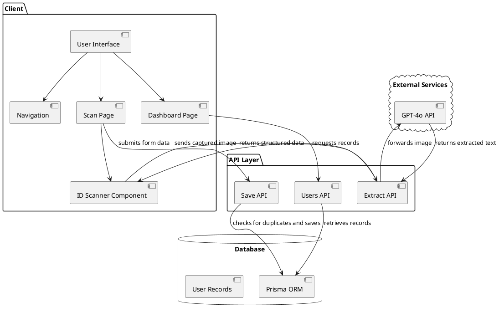

# ID Scanner System Architecture

## Overview

The ID Scanner application is a web-based system designed to capture, process, and store identification document information. It features both automated scanning via camera and manual data entry options, with a comprehensive dashboard for viewing stored records. The application integrates with GPT-4o API for AI-powered image analysis and text extraction.

## Architecture Diagram

## Component Breakdown

### Frontend Components

1. **Navigation Component** (`Navigation.tsx`)
   - Provides application-wide navigation
   - Responsive design with mobile menu
   - Highlights current active page

2. **Scan Page** (`scan/page.tsx`)
   - Main interface for capturing ID information
   - Toggle between camera scanning and manual entry
   - Form validation before submission

3. **ID Scanner Component** (`IDScanner.tsx`)
   - Camera integration for document capture
   - Image preview and processing
   - Extracted data handling

4. **Dashboard Page** (`dashboard/page.tsx`)
   - Displays all saved records in tabular format
   - Sorting by most recent first
   - Error handling for database connection issues

### Backend Components

1. **Extract API** (`/api/scan-id/extract/route.ts`)
   - Processes images from the ID Scanner
   - Communicates with GPT-4o API for text extraction
   - Parses AI response into structured data
   - Returns extracted information to the frontend

2. **Save API** (`/api/minimal-save-form/route.ts`)
   - Validates incoming data
   - Checks for duplicate IDs
   - Stores information in the database
   - Returns styled HTML responses for different scenarios

3. **Users API** (`/api/users/route.ts`)
   - Retrieves all user records
   - Sorts and formats data for dashboard display

### External Services

1. **GPT-4o API** 
   - Provides AI-powered image analysis
   - Extracts text from ID document images
   - Identifies and categorizes key information (name, ID number, dates)
   - Returns structured data in a format consumable by the application

### Database

- **Prisma ORM**: Object-Relational Mapping layer
- **User Model**: Stores ID information with the following schema:
  - `id`: Unique identifier (auto-generated)
  - `fullName`: Person's full name
  - `idNumber`: ID document number (unique)
  - `dateOfBirth`: Date of birth
  - `expiryDate`: Optional expiry date
  - `address`: Optional address information
  - `photoUrl`: Optional link to stored photo
  - `createdAt`: Timestamp of record creation

## Data Flow

1. **Scanning Flow**:
   - User captures ID image through camera
   - Image is sent to Extract API
   - Extract API forwards image to GPT-4o API
   - GPT-4o analyzes image and extracts text/structured data
   - Extract API processes AI response and returns formatted data
   - Extracted data populates form fields
   - User verifies and submits information

2. **Manual Entry Flow**:
   - User fills form fields manually
   - System validates required fields
   - Data is submitted to Save API

3. **Storage Flow**:
   - Save API checks for duplicate ID
   - If unique, creates new database record
   - Returns success page with record details and recent entries

4. **Retrieval Flow**:
   - Dashboard requests data from Users API
   - API queries database for all records
   - Records are displayed in table format

## Technologies Used

- **Frontend**:
  - Next.js (React framework)
  - TailwindCSS (Styling)
  - React Hooks (State management)
  - Webcam API (Camera integration)

- **Backend**:
  - Next.js API routes
  - Prisma ORM
  - Server-side validation
  - GPT-4o integration for AI image analysis

- **Database**:
  - PostgreSQL (or SQLite in development)

## Security Considerations

- Input validation on both client and server
- Duplicate ID detection to prevent overwriting
- Error handling with user-friendly messages
- Content-Type enforcement for API requests
- Secure handling of ID document images

## Scalability Considerations

- Database connection pooling through Prisma
- Stateless API design
- Component-based architecture for maintainability
- Responsive design for various devices
- Asynchronous processing of AI image analysis 